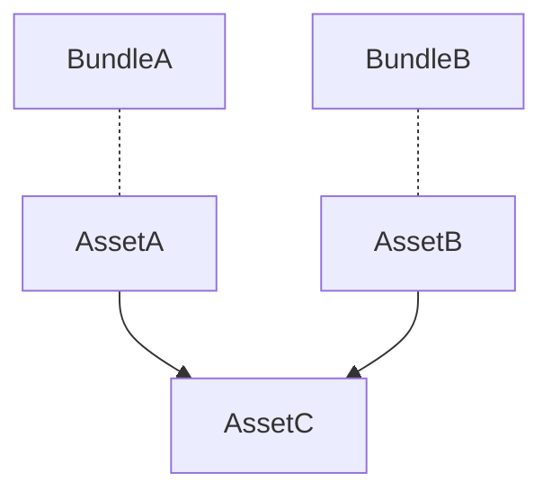
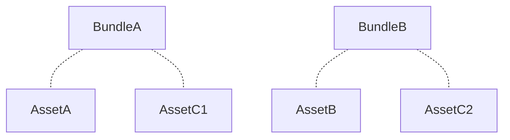
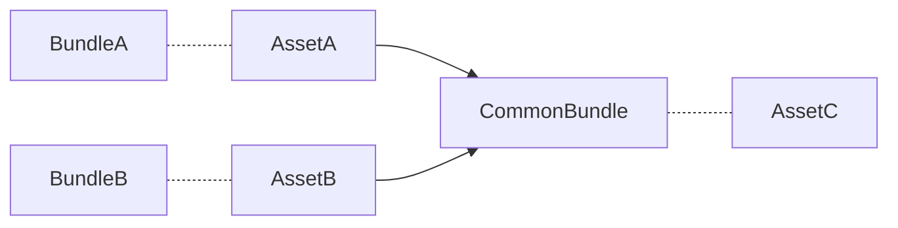

---
{"dg-publish":true,"permalink":"/02.DevWiki/Sources/유니티 어드레서블 사용시 주의해야할 부분들/","noteIcon":"","created":"2024-09-22T15:27:17.000+09:00","updated":"2025-08-17T15:40:49.033+09:00"}
---

## 1. 메모리 해제

> 😱 로드한 에셋을 명시적으로 해제하지 않으면 메모리상에 남아있을 수 있다

### 개요

- 에셋 로드시
    - 참조 카운트 +1
- 에셋 릴리즈시
    - 참조 카운트 -1
- 참조카운트가 0이 되면 해당 에셋은 메모리에서 내려간다

### Addressables.InstantiateAsync

- `ReleaseInstnace(handle 혹은 instance)`
    - 호출시 Handle과 인스턴스 모두 해제된다
        - 아래 두 방법 모두 같은 효과를 내지만 핸들을 사용하는게 좀 더 명확함
        - `ReleaseInstance(handle)`
        - `ReleaseInstance(instance)`
- `Release(handle)`
    - Instance는 여전히 남아있어 비정상 작동 할 수 있음에 주의

### Addressables.LoadAsset

- 더 이상 사용하지 않을 경우 `Release(handle 혹은 asset)` 호출하여 참조 해제

## 2. 번들간 중복 에셋 포함

<aside> 💡

어드레서블 그룹 설정에 따라 에셋들을 **그룹 단위**, **레이블 단위**, **개별 에셋 단위**로 쪼개서 하나의 에셋번들 단위로 묶을 수 있다

</aside>

### 공통 에셋을 참조할때..

- 위와 같이 서로 다른 번들에 속한 에셋들이 어드레서블에 속하지 않은 공통 에셋을 참조할 경우

### 에셋 중복 포함!

- 위와 같이 번들 A와 번들 B 모두에 AssetC가 중복 포함될 수 있다!

### 공통 에셋을 공통 번들로 분리하기

- 공통 에셋인 AssetC도 어드레서블 번들로 포함해야 중복 포함을 막을 수 있다
- 중복 참조되는 에셋들을 공용 번들로 분리하여 중복 포함을 막자!

🤔 모든 중복 참조를 다 공용 번들에 포함하면 공용 번들이 복잡해지고 크기가 너무 커지는거 아닌가?

- 중복 참조로 인한 문제보다 관리상의 이점이 크다 생각 든다면?
    - 예를들면 두세개의 에셋이 크기가 작은 공통 에셋을 중복 참조 하는 경우가 많고 이걸 일일히 추가하자니 하나하나 관리하기 너무 번거로울 경우
    - **그냥 중복 참조를 하자**

## 3. 일부 에셋 번들 업데이트

😄 어드레서블 원격배포시 어드레서블을 전체 빌드하는 것이 아닌 일부 변경된 에셋번들만 업데이트 할 수 있다

### 업데이트를 하고 싶다면 `addressables_content_state.bin`을 보존하라

- 일반적인 어드레서블 빌드를 수행한후 변경된 번들만 골라 원격에 업로드 할 경우
    - 카탈로그와 번들 내용이 일치하지 않아 클라이언트에서 문제가 발생한다!
- 일부 번들만 업데이트 하고 싶은 경우
    - `Update a Previous Build` 로 빌드를 해야 함
    - 이전에 빌드된 내용을 기반으로 변경사항의 빌드를 수행하기 때문에 이전 빌드의`addressables_content_state.bin` 가 보존되어 있어야 함
        - 만약 없다면 그냥 전체 빌드 해야함..