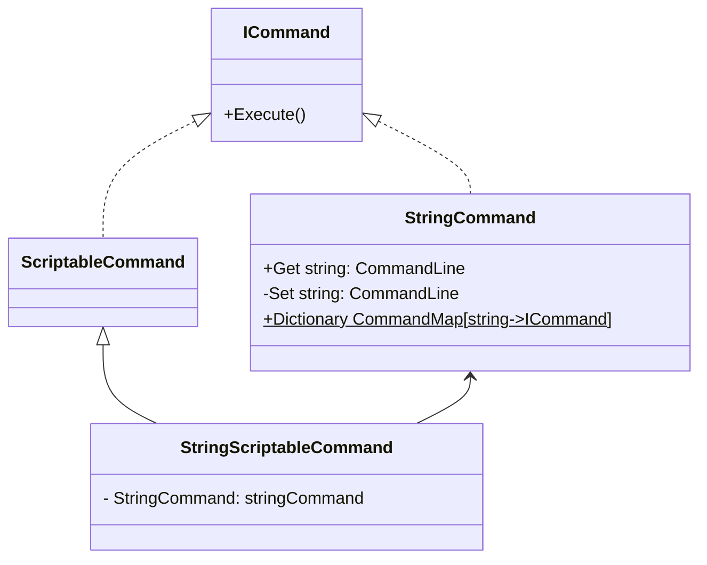

---
{"dg-publish":true,"permalink":"/Dev Notes/Unity Development Notes (Sources)/250131_커맨드 패턴을 이용해 메서드를 객체화하기/","noteIcon":"","created":"2024-12-15T23:26:49.000+09:00","updated":"2025-07-20T03:03:32.211+09:00"}
---

# 결과 & 활용
/Files/SetUpCommands.png)
- 에디터에서 Entity(캐릭터) 초기화 명령 커맨드 세팅
- Entity 초기화 과정에서 커맨드 배열을 순회하며 명령 실행, 세팅된 명령 함수가 알아서 Entity를 초기화

# 목표
- 함수를 객체화하여 다룰 수 있도록 한다
- 스크립트를 건들지 않고 에디터만으로 특정 객체에 내릴 명령 프리셋을 만들고 재활용할 수 있도록 한다

# 구현
- **구상**
    - 여러 명령 클래스들을 추상화하는 `ICommand` 인터페이스
    - `ScriptableObject`로 Command를 나타내기 위한 `ScriptableCommand`
    - 문자열을 통해 명령을 동작시킬 수 있도록 하기 위한 `StringCommand`와 `StringScriptableCommand`



- `ICommand` 와 `ScriptableCommand`
    
    - 이 두가지를 베이스로 커맨드 구현
    
    ```csharp
    public interface ICommand
    {
    		public void Execute(object target);
    }
    
    public abstract class ScriptableCommand : ScriptableObject, ICommand
    {
    	  public abstract void Execute(object target);
    }
    ```
    
    - 기본적으로 Command를 실행시키는 기능만 포함
    - 세부 구현은 일반 커맨드의 경우 `ICommand`, 스크립터블 커맨드의 경우`ScriptableCommand`를 상속하여 구현
- `StringCommand`
    
    - 본인이 지닌 키 `CommandLine` 에 부합되는 명령을 실행시키는 커맨드 객체
    - `CommandMap` : 문자열 키로 커맨드를 연결시켜주는 정적 딕셔너리
- `ScriptableStringCommand`
    
    - `StringCommand`를 `ScriptableObject`로 사용하기 위한 커맨드 객체

### StringCommand 문자열 키 세팅 자동화

>StringCommand를 통해 문자열로 커맨드를 호출하는 것 까진 좋은데 Key,Value 세팅을 하나하나 할수는 없다..

```csharp
private const string SetCommand = "Set";
public static void Initialize()
{
    InitializeEntityControllerCommand();
}

public static void InitializeEntityControllerCommand()
{
    var subclasses = ReflectionHelper.GetSubclasses<EntityController>();
    
    foreach (var sub in subclasses)
    {
        var commandString = SetCommand + sub.Name;
        
        var entityControllerSetCommandType = typeof(EntityControllerSetCommand<>).MakeGenericType(sub);
        var command = Activator.CreateInstance(entityControllerSetCommandType) as ICommand;
        
        StringCommand.CommandMap.Add(commandString, command);
    }
}
```

- `Reflection`으로 특정 타입을 상속받은 객체들을 찾고 자동 키,밸류 세팅
- `ReflectionHelper.GetSubclasses` 는 내가 만든 프레임워크의 함수

객체 초기화시 위 커맨드가 순차적으로 실행된다.

만약 객체 초기화 이후에도 스테이터스를 교체하거나 컨트롤러를 교체하고 싶다면 위 커맨드를 Entity에 전달해주면 된다!