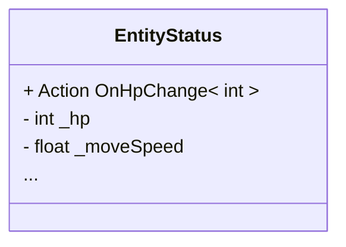
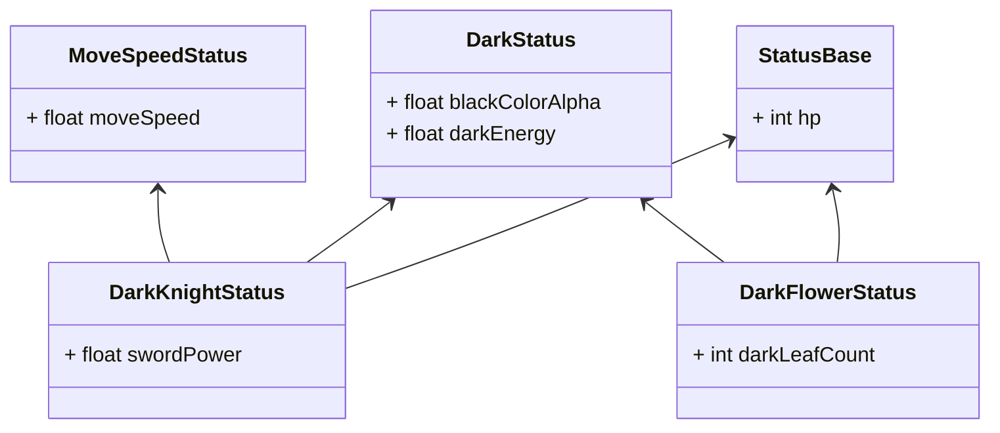
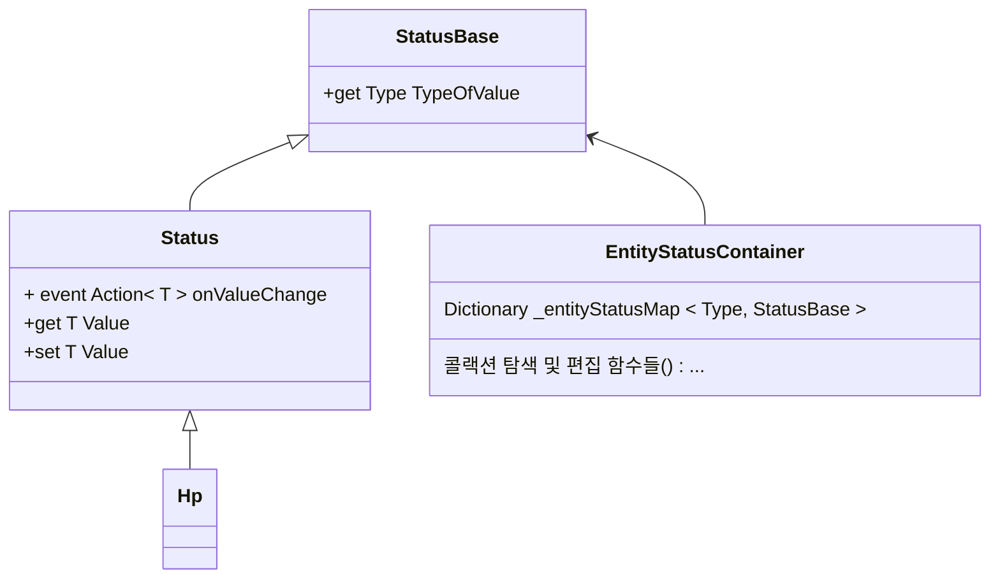
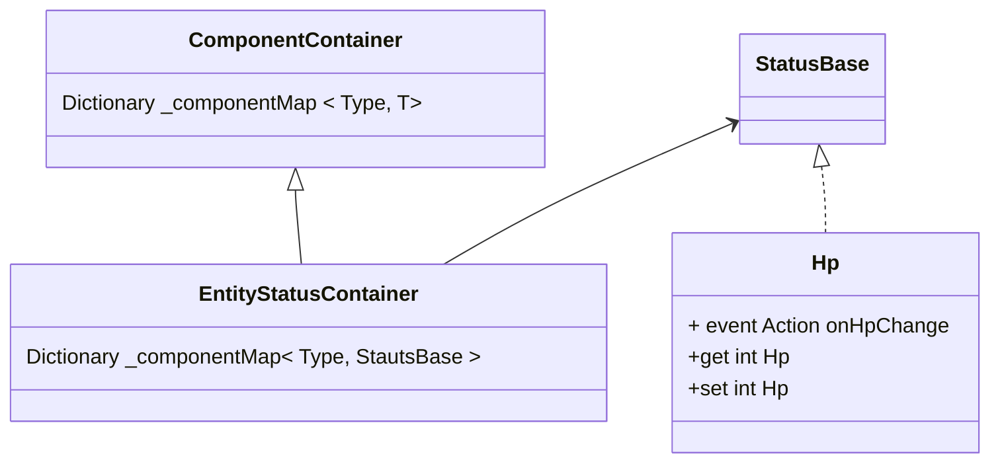
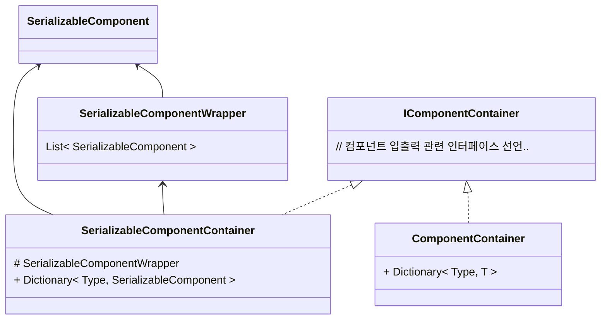

---
{"dg-publish":true,"permalink":"/__Archive__/개발일지/240901폐기된 유니티 토이프로젝트 일지/250202_확장성 있는 Entity의 Status시스템 구조 구상과 구현/","noteIcon":"","created":"2025-05-23T02:24:20.625+09:00","updated":"2025-07-20T02:59:22.013+09:00"}
---

# 최종 결과


- 각 Entity는 불필요한 Status 데이터를 지니지 않을 수 있다
- 인스펙터에서 스테이터스 컬렉션에 원하는 스테이터스 타입을 골라 추가할 수 있다

# 개요

- 용어 정의
    - Entity : Stauts를 사용하는 캐릭터 객체
    - Status 항목 : Hp등 스테이터스 개개 항목
    - Status 컨테이너 : Hp 등 Stauts항목이 담기는 집합체


> 기존에 프로토타입을 위해 간단하게 작성했던 Stauts 컨테이너 클래스의 구조




- **이 구조의 문제점,** 각 Entity간 **필요한 Status**가 다름
    - 예) 이동불가 Entity에겐 이동속도가 필요 없음
    - 소수에게만 사용되는 전용 Status 항목이 존재할 수 있음
    - 따라서 사용하지 않는 Status 항목들이 명시적 필드로써 전부 노출됨

> 🤔이런 부분들이 지금이야 몇개에 불과하지만 만약 게임이 고도화되면서 점점 특화된 스테이터스 수치가 추가된다면..?

# 솔루션

### 조합을 사용해본다면 어떨까?



> 🧐 공통 스테이터스 컨테이너를 만들고 이를 여러 Status들이 재사용하는 방식이다

- **해결된 점**
    - **필요하지 않은 Status구현 해결**
- **한계**
    - **여전히 유연성이 떨어짐**
        - 예) 만약 BlackColorAlpha 속성만 필요한 BlackCat이 추가된다면?
            - 중복구현 혹은 Status 컨테이너를 또 쪼개야 한다
            - 코드를 쪼개는 것도 일이고, 스테이터스 컨테이너 종류가 지나치게 많아지면 복잡성이 증가
    - **사용자 입장에서 필요한 Stauts를 모르는 것이 불가능**
        - Status 항목이 명시적인 필드 형태로 존재하기에 Hp만 사용할 사용자도 MoveSpeed 같은 필요 없는 정보에 접근할 수 있음
    - **뭣보다 구조가 복잡하다..**

### 추가 솔루션, Status를 컨테이너 단위가 아니라 요소 단위로 쪼개고 상세 구현을 감춰야 한다

- **스테이터스의 모듈화**
    - 각각의 스테이터스를 **독립된 모듈**로 분리, 구체적인 클래스 필드 명시형태로 선언하는게 아닌 모듈 방식으로 자유롭게 탈부착, 클래스의 내부 구현 변경 없이 유연하게 스테이터스 집합을 생성할 수 있도록 한다



### 인터페이스 정의

- **변경된 점**
    - 개별 Status 값 클래스로 래핑
    - Status 집합체 통합
        - 하나의 공통 클래스 ⇒ 모듈만 탈부착 방식
- **해결된 점**
    - Entity마다 서로 다른 Stauts필드 종류 가질 수 있으면서도 구체적인 구현은 감춤
    - 새로운 Status 집합이 필요하다 해도 새 클래스를 선언할 필요가 없음
        - 만약 새로운 Stauts필드 종류가 필요하다면 `StautsComponent`만 만들어주면 됨

# 모듈화

>만들고 나니 Status뿐만 아니라 다른곳에서도 쓰일 수 있다는 생각이 들었다



- 기본 로직은 동일, 그러나 Status뿐만이 아닌 다른 클래스에서도 재활용할 수 있도록 모듈화를 진행했다

# 인스펙터에서 수정 할 수 있게 바꿔보자


> 🧐 다양한 스테이터스를 개개의 객체로 다룰 수 있게 된 것은 좋다, 그런데 아직 문제가 있다.

### 인스펙터에서 스테이터스를 수정할 수 없다

- **유니티 직렬화의 한계 때문**
    1. **Dictionary**
        1. 유니티는 딕셔너리 직렬화를 기본적으로 지원하지 않음
    2. **Stauts 요소들이 이제 명시적 필드가 아님**
        1. 유니티는 기본적으로 명시적인 타입 직렬화만 지원함


> 🧐 그럼 방법이 없나?
### 커스텀 에디터를 사용하면 해결할 수 있다

- `[SerializeReference]`
    - 인터페이스, 클래스간 상속관계등을 직렬화 할 수 있게 도와주는 속성
- `PropertyDrawer`
    - 특정 타입이 인스펙터에 어떻게 그려질지 커스텀
- `ReorderbaleList`
    - 인스펙터에 출력되는 리스트 타입의 기능과 모양 재정의

### `ComponentContainer`를 두 종류로 나누기



- 왜 두가지로 나뉘었나?
    - `[SeralizeReference]`를 사용하면 서브 클래스도 직렬화가 가능한건 맞지만.. 여전히 한계가 있다!
        - 제너릭 클래스는 여전히 직렬화가 불가능하다! 때문에 명시적 타입을 쓰는 클래스로 분리했다
    - `SerializableComponentContainer`는 `SerializableComponent`를 상속받은 객체만 담을 수 있음
    - 직렬화가 필요 없는 경우, 일반 `ComponentContainer`를 사용하면 불필요한 상속을 피할 수 있어 더 효율적
- `SerializableComponentWrapper`는 뭔가?
    - 커스텀 하려는 것이 `SerializableComponent` 단일 객체가 아니라 `SerializableComponent`의 리스트이기 때문이다, 따라서 리스트를 묶어줄 객체가 필요함
        
        ```csharp
public class SerializableComponentWrapper
{
	[SerializeReference]
	public List<SerializableComponent> Components = new ();   
}
        ```
        
    - `SerializableComponentWerapper` 는 실제 사용하는것이 아닌 데이터를 직렬화하여 인스펙터에서 편집 하기 위한 용도
        
    - 런타임에는 그 데이터를 꺼내와서 `Dictionary<Type, ComponentContainer>` 에 삽입하여 사용한다!
        
```csharp
[Serializable]
public class SerializableComponentContainer<T> : ComponentContainerBase<T> where T : SerializableComponent
{
	[SerializeReference] private SerializableComponentWrapper serializableComponentWrapper = new();
	private Dictionary<Type, T> _componentMap;
	protected override Dictionary<Type, T> ComponentsMap
	{
		get
		{
			if (_componentMap == null)
			{
				_componentMap = new Dictionary<Type, T>();
				foreach (var data in serializableComponentWrapper.Components)
				{
					_componentMap.Add(data.GetType(), data as T);
				}
			}
			return _componentMap;
		}
		set => _componentMap = value;
	}
}
```     

> 이제 SerializableComponentWrapper에 대한 PropertyDrawer 클래스만 적절하게 만들어주면 된다!